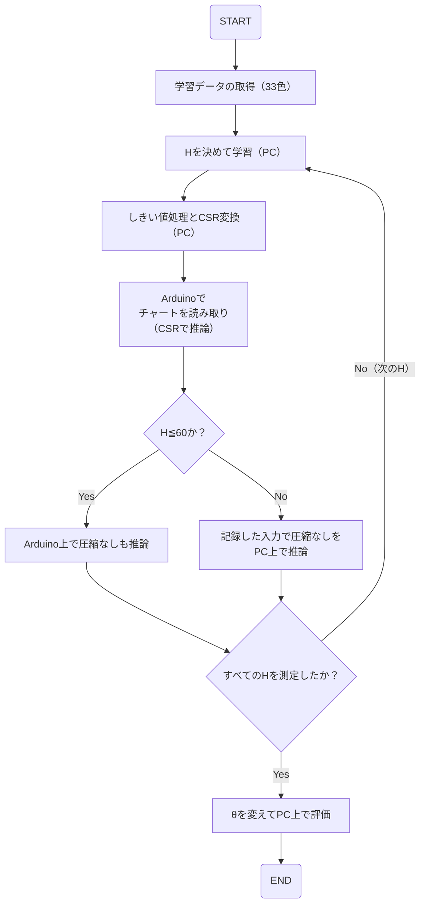

```mermaid
graph TD
    start(START)
    data[学習データの取得（33色）]
    train[Hを決めて学習（PC）]
    csr[しきい値処理とCSR変換（PC）]
    read[Arduinoで<br>チャートを読み取り<br>（CSRで推論）]
    if1{H≦60か？}
    dense_ard[Arduino上で圧縮なしも推論]
    dense_pc[記録した入力で圧縮なしをPC上で推論]
    if2{すべてのHを測定したか？}
    theta[θを変えてPC上で評価]
    end1(END)

    start --> data
    data --> train
    train --> csr
    csr --> read
    read --> if1
    if1 -->|Yes|dense_ard
    if1 -->|No|dense_pc
    dense_ard --> if2
    dense_pc --> if2
    if2 -->|No（次のH）|train
    if2 -->|Yes|theta
    theta --> end1

```
